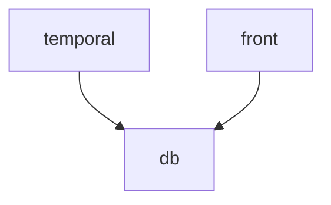
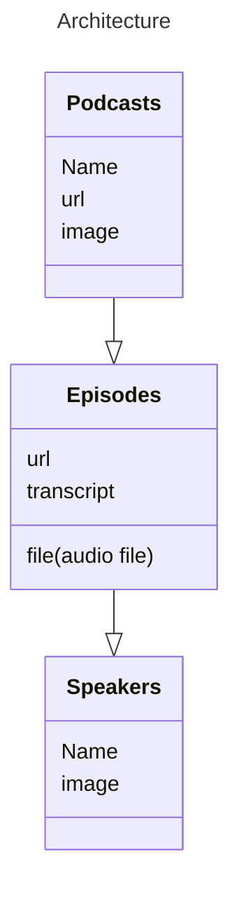
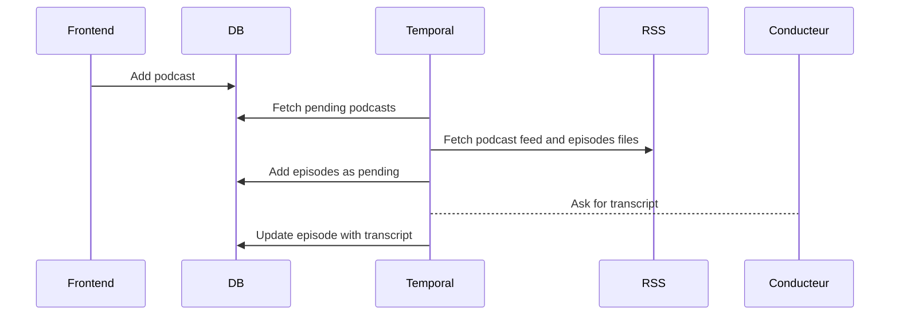

# transcript

```mermaid
graph TD;
temporal --> db;
front --> db;
```

## Architecture

```mermaid
---
title: Architecture
---
classDiagram
    Podcasts --|> Episodes
    Episodes --|> Speakers

    class Podcasts{
        Name
        url 
        image
    }
    class Episodes{
        url
        file (audio file)
        transcript
        
    }
    class Speakers {
        Name
        image
    }
```

```mermaid
sequenceDiagram
    Frontend ->> DB: Add podcast
    Temporal ->> DB: Fetch pending podcasts
    Temporal ->> RSS: Fetch podcast feed and episodes files
    Temporal ->> DB: Add episodes as pending
    Temporal --> Conducteur: Ask for transcript
    Temporal ->> DB: Update episode with transcript


```

## Features
- [ ] Add podcast Rss feed
- [ ] Ask for transcript and upload to db
- [ ] 